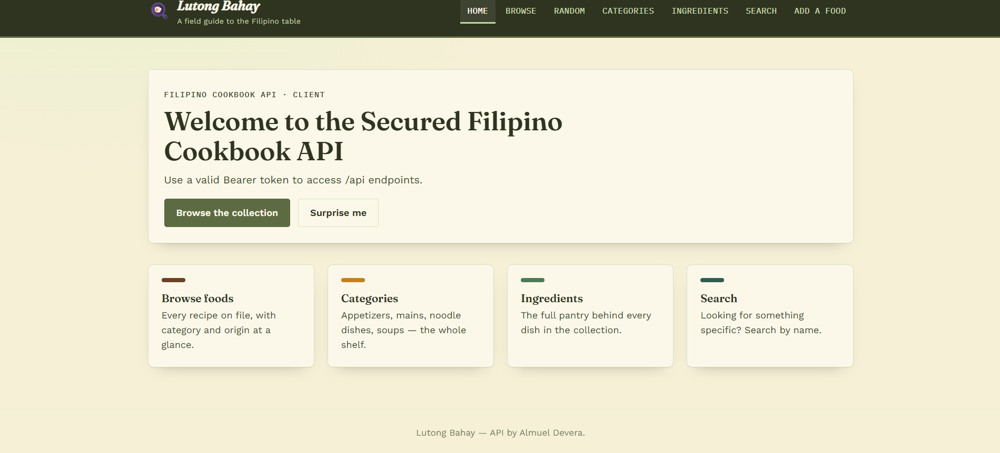
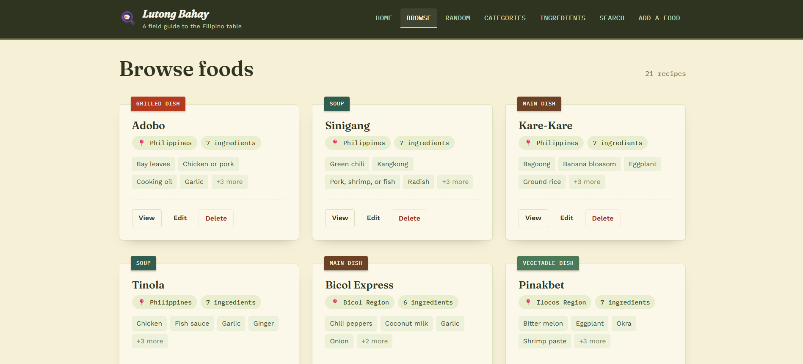
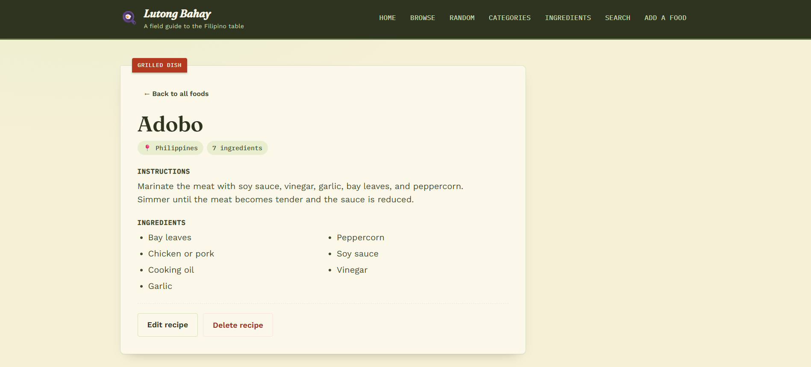
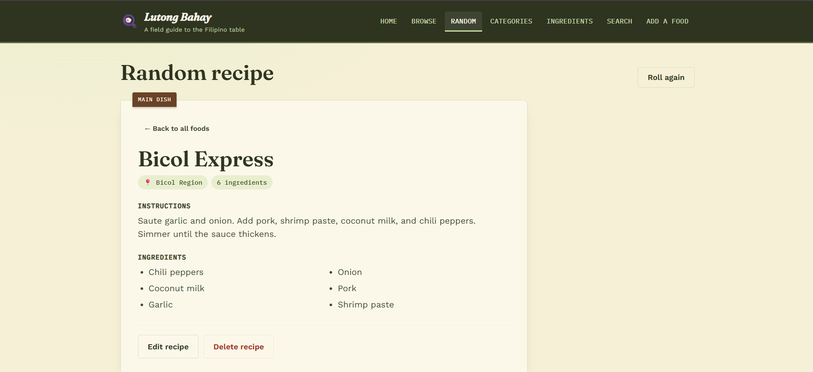
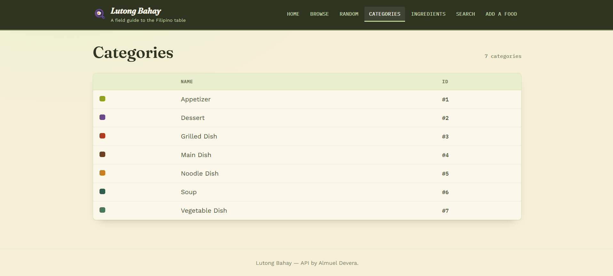
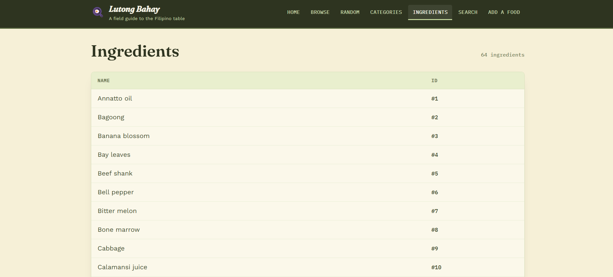
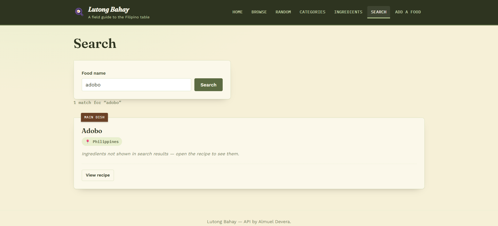
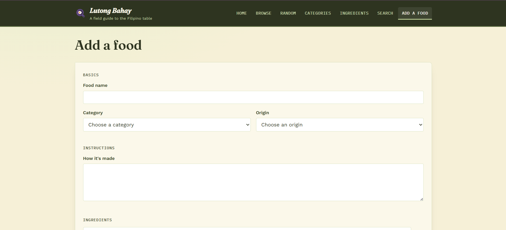
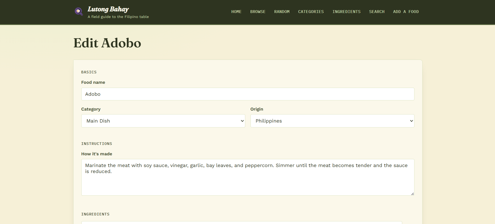
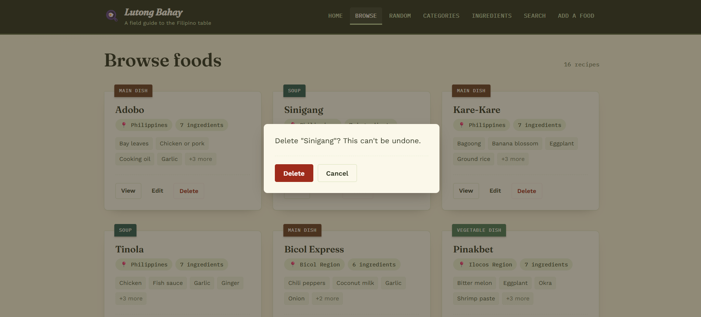

# Lutong Bahay — Filipino Cookbook Client

## Application Description

Lutong Bahay is a static web application that serves as a client for the **Filipino Cookbook API**, a REST API developed using PHP 8, the Slim Framework 4, and MySQL. The application communicates with the API through the Fetch API to retrieve and manage information about Filipino dishes.

The client provides an interface for browsing recipes, viewing complete recipe details, searching for dishes by name, displaying a random recipe, and managing recipe records through create, update, and delete operations.

The application is intended for home cooks, students exploring Filipino cuisine, and developers who want to see a practical example of a frontend consuming a RESTful API.

### Features

- Browse all available Filipino recipes
- View complete recipe details, including ingredients and cooking instructions
- Display a randomly selected recipe
- Search recipes using partial food names
- View available food categories
- View the list of ingredients stored in the database
- Add new recipes with multiple ingredients
- Update existing recipes
- Delete recipes with confirmation before removal

---

## Technologies Used

| Category | Technology |
|-----------|------------|
| Markup | HTML5 |
| Styling | CSS3 |
| Programming Language | JavaScript (ES6 Modules) |
| Data Fetching | Fetch API |
| Routing | Custom hash-based router |
| Fonts | Google Fonts (Fraunces, Work Sans, IBM Plex Mono) |
| Backend API | Filipino Cookbook API (PHP 8, Slim Framework 4, MySQL, PDO) |
| Version Control | Git & GitHub |

Since the project is a static web application, no package manager or build tools are required.

---

## Installation Instructions

### Clone the Repository

```bash
git clone https://github.com/lloydsierra/filipino-cookbook-client-sierra.git
cd filipino-cookbook-client-sierra
```

### Configure the API

Open `js/config.js` and update the API configuration.

```javascript
export const BASE_URL = 'http://localhost/cookbook-api-test/public/index.php';
export const API_TOKEN = 'bearer dmmmsu-cookbook-token-2026';
```

The `BASE_URL` should point to the location where the Filipino Cookbook API is hosted.

The `API_TOKEN` must match the bearer token configured on the API server so that authenticated requests can be processed successfully.

### Run the Application

The client can be served using any static web server.

Example using VS Code Live Server:

1. Open the project folder.
2. Start Live Server.
3. Open the generated local address (commonly `http://localhost:5500`).

> Opening `index.html` directly through `file://` is not supported because ES Modules require an HTTP server.

### CORS

If the client and API are hosted on different origins, the API must allow cross-origin requests by enabling the appropriate CORS headers.

---

## API Endpoints Used

The client consumes the following endpoints provided by the Filipino Cookbook API.

| Method | Endpoint | Purpose |
|---------|----------|---------|
| GET | `/` | Displays the API welcome message on the home page |
| GET | `/api/foods` | Retrieves all recipes together with their ingredients |
| GET | `/api/foods/{id}` | Retrieves the complete details of a specific recipe |
| GET | `/api/foods/random` | Retrieves one randomly selected recipe |
| GET | `/api/foods/search/{name}` | Searches recipes by partial food name |
| GET | `/api/categories` | Retrieves all food categories |
| GET | `/api/ingredients` | Retrieves all available ingredients |
| POST | `/api/foods` | Creates a new recipe |
| PUT | `/api/foods/{id}` | Updates an existing recipe |
| DELETE | `/api/foods/{id}` | Removes a recipe from the database |

The API does not provide an endpoint for food origins. Since the list of origins is fixed, the client stores these values locally in `js/data.js`.

---

## Screenshots (ongoing)

The following screenshots demonstrate the different views and features of the application.

### Home Page



### Browse Foods



### Recipe Details



### Random Recipe



### Categories



### Ingredients



### Search Results



### Add Recipe



### Edit Recipe



### Delete Confirmation



---

## API Source and Acknowledgment

This client application uses the **Filipino Cookbook API** developed by:

**Developer:** Almuel Devera

**GitHub Repository:**
https://github.com/almueldevera45-oss/almueldevera45-oss-filipino-cookbook-api-devera.git

The API is used for educational purposes with the permission of the developer. The API design, database implementation, and backend logic belong to the original developer, while this repository contains only the client application that consumes the API.